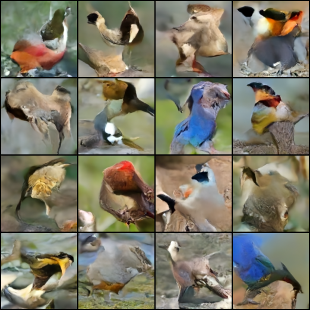

# pydiffusion
A repository for diffusion models from scratch
</img>

## Denoising Diffusion Probabilistic Model, in Pytorch

Implementation of <a href="https://arxiv.org/abs/2006.11239">Denoising Diffusion Probabilistic Model</a> in Pytorch. 

This implementation was transcribed from the official Tensorflow version <a href="https://github.com/hojonathanho/diffusion">here</a> and Phil Wang's implementation <a href="https://github.com/lucidrains/denoising-diffusion-pytorch"> here </a>

  

Sample after training a gaussian diffusion model on Kaggle bird dataset with the configuration : 
```python
unet = Unet(64)
image_size = 128
diffusion_model = GaussianDiffusion(unet, image_size=image_size, timesteps=1000, sampling_timesteps=100)

trainer = Trainer(diffusion_model, 
                  '/kaggle/input/100-bird-species/valid/', 
                  train_num_steps=10000, 
                  calculate_fid=False, 
                  save_and_sample_frequency=1000)
```

## Run the model
You can use the file `whole_model.py` to start the code on a notebook for example  
To run the model locally you can see the file `test.py`  

Samples and model checkpoints will be logged to `./results` periodically (the timestep can be changed in the code)


## Citations

```bibtex
@InProceedings{pmlr-v139-nichol21a,
    title       = {Improved Denoising Diffusion Probabilistic Models},
    author      = {Nichol, Alexander Quinn and Dhariwal, Prafulla},
    booktitle   = {Proceedings of the 38th International Conference on Machine Learning},
    pages       = {8162--8171},
    year        = {2021},
    editor      = {Meila, Marina and Zhang, Tong},
    volume      = {139},
    series      = {Proceedings of Machine Learning Research},
    month       = {18--24 Jul},
    publisher   = {PMLR},
    pdf         = {http://proceedings.mlr.press/v139/nichol21a/nichol21a.pdf},
    url         = {https://proceedings.mlr.press/v139/nichol21a.html},
}
```

```bibtex
@article{Song2021DenoisingDI,
    title   = {Denoising Diffusion Implicit Models},
    author  = {Jiaming Song and Chenlin Meng and Stefano Ermon},
    journal = {ArXiv},
    year    = {2021},
    volume  = {abs/2010.02502}
}
```

```bibtex
@article{Salimans2022ProgressiveDF,
    title   = {Progressive Distillation for Fast Sampling of Diffusion Models},
    author  = {Tim Salimans and Jonathan Ho},
    journal = {ArXiv},
    year    = {2022},
    volume  = {abs/2202.00512}
}
```

```bibtex
@article{Ho2022ClassifierFreeDG,
    title   = {Classifier-Free Diffusion Guidance},
    author  = {Jonathan Ho},
    journal = {ArXiv},
    year    = {2022},
    volume  = {abs/2207.12598}
}
```

```bibtex
@inproceedings{Hang2023EfficientDT,
    title   = {Efficient Diffusion Training via Min-SNR Weighting Strategy},
    author  = {Tiankai Hang and Shuyang Gu and Chen Li and Jianmin Bao and Dong Chen and Han Hu and Xin Geng and Baining Guo},
    year    = {2023}
}
```

```bibtex
@misc{Guttenberg2023,
    author  = {Nicholas Guttenberg},
    url     = {https://www.crosslabs.org/blog/diffusion-with-offset-noise}
}
```

```bibtex
@inproceedings{dao2022flashattention,
    title   = {Flash{A}ttention: Fast and Memory-Efficient Exact Attention with {IO}-Awareness},
    author  = {Dao, Tri and Fu, Daniel Y. and Ermon, Stefano and Rudra, Atri and R{\'e}, Christopher},
    booktitle = {Advances in Neural Information Processing Systems},
    year    = {2022}
}
```
